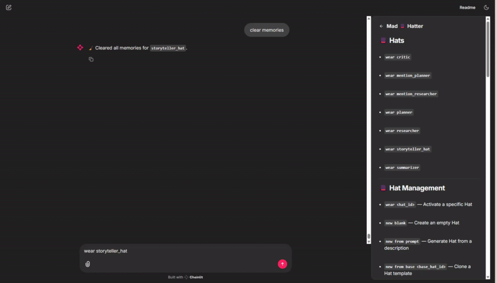
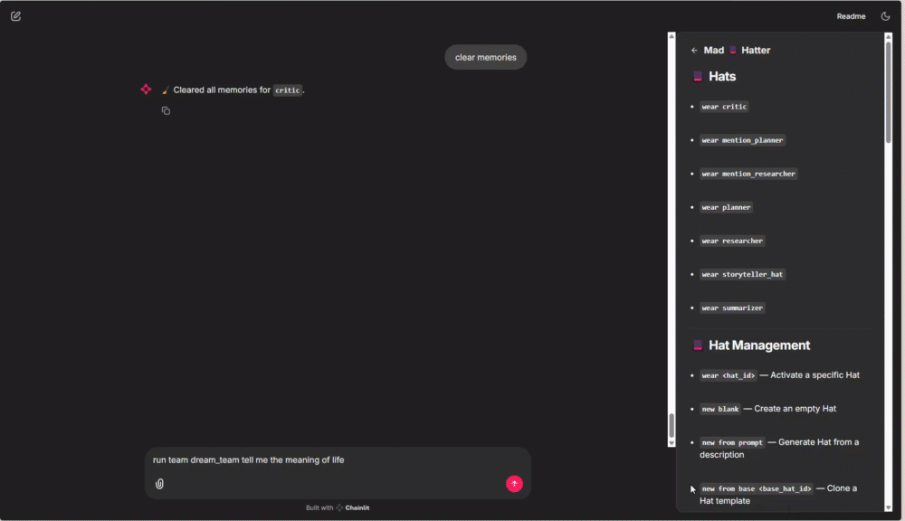

# Mad 🎩 Hatter — Modular AI Agent System for Chainlit  
> **Microsoft AI Agents Hackathon Submission**  
> A flexible orchestration framework where every agent wears a "Hat" — equipped with memory, identity, tools, and team logic.

---

## ✨ What It Is

MadHatter is a local llm - compatible multi-agent AI framework built with Chainlit. Each “Hat” is a self-contained AI agent with:

- 🔐 Unique identity & memory
- 🛠️ Tooling[WIP] and @mentionable relationships
- 🧠 Vector search-based memory injection
- 🧪 QA feedback with retry logic
- 👤 Human-in-the-loop approval
- 👥 Team orchestration with custom flow orders
- 🗓️ Schedule-driven hat switching

---

## 🧠 Concept Overview

| Concept | Description |
|--------|-------------|
| **Hats** | Modular agents with name, role, model, instructions, tools, memory, and logic |
| **Teams** | Chain multiple Hats to solve a goal — `Planner → Researcher → Critic` |
| **QA Loops** | Critics provide reviews with tags like `#APPROVED`, trigger retries automatically |
| **Memory** | Injects relevant past conversations into prompts. Taggable, searchable |
| **Mission Debrief** | Auto-generated summary after each run, includes Agent Reflections |
| **MVP Awards** | Agents get recognized at the end for highest contribution |

---

## 🔥 Why It’s a Strong Hackathon Contender

### 🧩 **Composable Agent Architecture**
Each “Hat” is a modular AI agent with its own ID, role, instructions, tools, and memory. You can create Hats from scratch, clone them from templates, or generate them via prompt using OpenAI or local models. Hats can be composed into multi-step teams with flow order control, enabling complex orchestration with zero boilerplate. This plug-and-play model makes it easy to prototype new agent workflows rapidly — perfect for hackathon iteration.

### 🧠 **Per-Agent Memory with Contextual Recall**
The **Hat Memory System** stores each Hat’s interactions in an isolated vector database using ChromaDB. Memories are tagged, timestamped, and role-annotated, and the top relevant ones are automatically retrieved and injected into prompts for contextual awareness. Hats "remember" past conversations — making them more coherent, consistent, and self-evolving over time.

### 🎭 **@Mentions & Relationship-Aware Reasoning**
Agents can dynamically trigger other agents using @mentions in natural language. Each Hat can have `relationships` — other Hats it can call by ID — creating an emergent collaboration pattern. For example, a Planner can call @researcher for data mid-response, and their outputs are automatically routed, executed, and logged.

### 🕵️ **Mission Debriefs & Agent Reflections**
At the end of a team flow, the system generates a full **Mission Debrief** summarizing the outcome, teamwork, and challenges. Each agent then provides its own **AI Reflection**, sharing what it “learned” or how it performed — a novel way to showcase transparency, narrative, and insight in agent-based systems. It also announces an **MVP Agent Award**, giving life and character to the agents.

### 🔄 **Built-In QA Loops with Critic & User Approval**
Any Hat can opt into a **QA feedback loop**. A designated Critic agent reviews the output, assigns scores, and tags it with `#APPROVED`, `#REVISION_REQUIRED`, or `#REJECTED`. If revision is required, the system retries the agent’s response with updated guidance — all before requiring the human to step in. This simulates Human-in-the-Loop pipelines and ensures quality control is deeply baked into the framework.

### 💡 **Prompt-to-Team: Zero to Agents in Seconds**
Just describe your goal in plain English. The system uses OpenAI to generate a team of Hats with distinct roles, IDs, instructions, and flow logic. It validates schema, saves them, and shows you a proposed team structure instantly — making it perfect for rapidly spinning up intelligent agents for any domain.

### 👀 **Chainlit UI with Full Control**
The app features a responsive UI powered by Chainlit with:
- A persistent **Hat Sidebar** (like ChatGPT’s thread selector)
- Clickable **action buttons** to wear, edit, or schedule agents
- A **Hat Editor** with full JSON inspection/modification
- Real-time commands like `view memories`, `run team`, `create team`, etc.
- A visual **TODOs list** embedded directly in the interface

---

## 📸 Feature Showcase

| Feature | Preview |
|--------|---------|
| 🔷 Chainlit UI + Sidebar |  |
| 🧠 Hat Memory Viewer and Memory Tagging     |      |
| 🤖 Multi-Agent Team Flow |   |
| 🆠Agent MVP Awards      |      |
| 📋 Debrief Summary       |     |
| @Mentions                |     |
| 🤠Reflections           |  |
---

## 🧠 Hat JSON Schema

Each Hat is a modular agent with its own identity, behavior, memory, and logic. Here's an example schema with descriptions:

```jsonc
{
  "hat_id": "planner", // Unique identifier for the Hat
  "name": "Mission Planner Clone", // Human-readable name
  "model": "gpt-3.5-turbo", // LLM to use (e.g. OpenAI or local)
  "role": "planner", // Role/purpose (planner, critic, summarizer, etc.)
  "instructions": "Design structured plans, strategies, and roadmaps to achieve specified goals. Be clear, step-by-step, and anticipate risks.", // Prompt instructions given to the LLM
  "tools": [], // Optional tool integrations (not yet implemented) [WIP]
  "relationships": [], // List of other Hat IDs this one can call via @mention
  "team_id": "dream_team", // ID of the team this Hat belongs to
  "flow_order": 1, // Execution order within a team (lower runs first)
  "qa_loop": false, // Whether this Hat's output should be reviewed by a Critic
  "critics": [], // List of Critic Hat IDs (used if qa_loop is true)
  "active": true, // Whether this Hat is currently in use [WIP]
  "memory_tags": ["planning", "strategy"], // Default memory tags for saved interactions
  "retry_limit": 1, // How many times to retry if a Critic requests revision
  "description": "Creates strategic plans and outlines to guide team missions.", // Short explanation of this Hat's purpose
  "base_hat_id": "planner" // Template ID this Hat was cloned from (if any)
}
```

This schema enables flexible orchestration, personalized behavior, and future support for tool-calling, tagging, and collaboration across agents.

---
## 🎩 Built-in Hat Templates

These JSON files define ready-to-use agent personas. You can clone, customize, or combine them to form collaborative teams.

| File Name               | Description |
|-------------------------|-------------|
| `planner.json`          | 🧭 **Mission Planner** – Designs structured plans, strategies, and risk-aware roadmaps to achieve specific goals. |
| `researcher.json`       | 🔍 **Information Researcher** – Gathers background knowledge, trends, or factual insights in bullet-point form. |
| `critic.json`           | 🧑‍⚖️ **Quality Assurance Critic** – Reviews other Hats' outputs, scores them, and triggers retries when needed. |
| `summarizer.json`       | ✂️ **Content Summarizer** – Condenses long input into clear, concise bullet points or short summaries. |
| `storyteller_hat.json`  | 📖 **Storyteller Agent** – Creates cozy, imaginative stories with tone adapted to prompts (e.g., bedtime or fantasy). |
| `mention_planner.json`  | 🧠 **Mentionable Planner** – Similar to the Mission Planner but explicitly calls other Hats (e.g., @researcher) when reasoning. |
| `mention_researcher.json` | 🧠 **Mentionable Researcher** – Variant of the Researcher Hat, designed to be triggered via @mention by other agents. |

You can extend or remix these templates to create your own agents or team configurations.

---

## 🛠️ Tech Stack

- **Chainlit** — Conversational UI layer
- **OpenAI** — LLM backend for smart reasoning. Currently Set to just use gpt-3.5-turbo but planned functionality/schema planned to change the model per hat
- **Ollama** — Local model generation for Hat creation. Currently disabled for hackathon. Uses gpt-3.5-turbo through the open ai api for ease of use 
- **ChromaDB** — Per-agent vector memory persistence
- **Python** — Orchestration + logic

---

## ⚙️ Setup Instructions

### 🟢 Codespaces

1. **Open in Codespace** (GitHub Codespaces)
2. **Create a `.env` file** with your OpenAI API Key  
   – Reference the format in `env.sample.txt`
3. **Copy Hat Template Files**  
   – Move all `.json` files from `hat_template/` into the `hats/` directory
4. **Install dependencies**  
   ```bash
   pip install -r requirements.txt
   ```
5. **Run the app**  
   ```bash
   chainlit run app.py
   ```

---

### 💻 Local Development

1. **Clone this repo**
   ```bash
   git clone https://github.com/your-username/hat-manager.git
   ```
2. **Navigate into the project folder**
   ```bash
   cd hat-manager
   ```
3. **Copy Hat Template Files**  
   – Move all `.json` files from `hat_template/` into the `hats/` directory
4. **Create a `.env` file**  
   – Add your `OPENAI_API_KEY`
5. **Install dependencies**
   ```bash
   pip install -r requirements.txt
   ```
6. **Run the app**
   ```bash
   chainlit run app.py
   ```

---

## 🚀 Command Cheatsheet

| Command | Description |
|--------|-------------|
| `wear <hat_id>` | Wear (activate) a specific Hat |
| `new blank` | Create a new Hat from scratch |
| `new from prompt` | Use LLM to create a Hat from a description |
| `edit <hat_id>` | Start editing by pasting JSON |
| `tag last as <tag>` | Tag the last memory for the current Hat |
| `current hat` | Show the currently active Hat |
| `new from base <base_hat_id>` | Clone a Hat from a template |
| `create team` | Prompt for goal → generate team of Hats |
| `save team` | Save the currently proposed team |
| `show team json` | Show raw JSON of the proposed team |
| `run team <team_id> [goal]` | Run a saved team with optional goal |
| `view team <team_id>` | List Hats in a team with flow order |
| `new story team <prompt>` | Shortcut: Storyteller + Critic team |
| `view memories` | View top memories of the active Hat |
| `view memories <tag>` | View filtered memories by tag |
| `clear memories` | Clear memory for active Hat |
| `export memories <hat_id>` | Export memories of a Hat to JSON (via UI) |
| `debug memories` | Show raw memory count and structure |
| `set schedule` | Start scheduling flow (time selection) |
| `view schedule` | View the schedule of Hats |
| `view missions` | Show saved mission archive files |
| `help` | Show command help menu |
| (mentions) `@hat_id` | Trigger another Hat by inline mention |

---

## ✅ Features Completed

- [x] @Mentions (inline Hat calls)
- [x] Per-Hat tagging + memory context
- [x] Full critic-based QA retry loop
- [x] Post-mission debrief + reflections
- [x] MVP awards for top contributing agent
- [x] Dynamic team creation from a single prompt

---

## 🛣️ Roadmap & Stretch Goals

- [ ] 🧠 Import memories from other tools or files
- [ ] 🔄 “Run Again” button post-approval
- [ ] 🧭 Visual Flow Builder (Mermaid or Graph UI)
- [ ] 🧰 Tool integration (APIs, plugins)
- [ ] 🧠 Memory tagging UI + import/export
- [ ] 🌩️ Azure AI / AutoGen integration

---

## 🙏 Credits

Built for the **Microsoft AI Agents Hackathon** using:
- [Chainlit](https://docs.chainlit.io)
- [Ollama](https://ollama.com)
- [ChromaDB](https://www.trychroma.com)
- [OpenAI](https://openai.com)


DEMO: Link here

## ✅ **Already Implemented But Not Covered fully in Demo**

### ⏰ **1. Scheduled Hat Switching**

- Use `set schedule` to assign specific Hats to activate at defined times.
    
- Hats auto-switch when the system clock matches the scheduled time.
    
- View your schedule with `view schedule`.
    

---

### 📦 **2. Base Hat Templates + Cloning**

- Clone a reusable Hat with:
    
    ```text
    new from base <hat_id>
    ```
    
- Automatically generates a unique ID and resets team context.
    
- Great for scaling and standardizing agent designs.
    

---

### 🧠 **3. Tag-Based Memory + Filtering**

- Tag any memory with:
    
    ```text
    tag last as <tag>
    ```
    
- Retrieve memories by tag:
    
    ```text
    view memories <tag>
    ```
    
- Also includes full memory debug and clearing via:
    
    ```text
    debug memories
    clear memories
    ```
    

---

### 🔁 **4. QA Loop via Command**

- Use:
    
    ```text
    add qa to <hat_id>
    ```
    
- Automatically:
    
    - Enables QA loop
        
    - Adds a critic to the Hat's config
        
    - Clones and inserts the Critic Hat into the team if needed
        

---

## 🛠️ **Planned / Not Yet Implemented**

### 🔄 **1. Parallel Execution for Same `flow_order`**

- When multiple Hats share the same `flow_order`, they will run concurrently.
    
- Example: All Hats with `flow_order: 2` process in parallel.

### 📊 **2. Flow Chart Generator**

- Will visualize team structure based on `flow_order`, roles, and relationships.
    
- Planned implementation using Mermaid.js or another flowchart engine.
    
###  3. ***Specific Tools Integration***

- Tools currently not implemented yet, but is planned and already handled in the schema. 

###  4. **Copilot Extension**

- Would love to give the Copilot SDK and other Agent Frameworks the option to wear a hat!

###  5. **Dynamic LLM usage**
- Switch Between different local, or external models and allow each hat to be a different model or agent at it's based
- My current setup is hybrid. I create hats using ollama locally, and then the schema is used with OPEN AI. 

------------------------------------------------------------------------------------------ 

# 🧠 Hat Memory System Documentation

### **Overview**
The Hat Memory System integrates local vector databases (ChromaDB) into individual AI agents, known as "Hats". Each Hat maintains its own context and memory, allowing for personalized and contextually aware interactions.

### **How Memory Works**

- **Per-Hat Vector Store**:
  - Each Hat has a unique vector store using ChromaDB.
  - Collections named after `hat_id`.

- **Memory Retrieval**:
  - Queries Hat’s vector store for similar past interactions.
  - Top **k** relevant memories retrieved and injected into system prompt.

- **Memory Injection**:
  ```
  You are an AI agent with the '{hat_name}' persona.

  Here are some relevant memories:
  - Memory 1
  - Memory 2
  - Memory 3
  ```

- **Memory Storage**:
  - After every message, both **user input** and **AI response** are stored.

### **Key Functions**
- `get_vector_db_for_hat(hat_id)`
- `add_memory_to_hat(hat_id, memory_text)`
- `search_memory(hat_id, query, k=3)`
- `clear_memory(hat_id)`

### **User Commands**
- `view memories`
- `clear memories`

### **Persistence**
- ChromaDB uses `./chromadb_data` for session persistence.

---

### **Example Flow**
1. User sends: **"Tell me about AI in healthcare."**
2. System queries past memories.
3. Injects top 3 into the prompt.
4. AI responds.
5. Both message & response stored for future queries.

---

### **Future Enhancements**
- Add **metadata tagging**.
- Provide UI for manual memory control.
- Support **memory snapshot import/export**.

> This memory system enables **personalized and evolving AI** by ensuring each Hat retains and utilizes past context intelligently.

------------------------------------------------------------------------------------------ 
# 📝 **Summary: How to Integrate Critic to Any Agent for Retry Loops**

Here’s a concise step-by-step **guide** on how you integrated the **Critic Agent** with **any Hat** to enable **QA loops** (retry logic), **assuming Critic is hardcoded** for now.

---

## 🎯 **1️⃣ Enable QA Loop for Target Hat**
- In the target Hat's JSON:
  ```json
  "qa_loop": true,
  "critics": ["critic_auto_team_test"]  // Reference to the hardcoded Critic
  ```

---

## 🎯 **2️⃣ Add the Critic Agent to the Team**
- Ensure the **Critic Agent** is also part of the same `team_id`.
- Critic's `flow_order` must come **after** the target Hat it reviews.

---

## 🎯 **3️⃣ Runtime Flow Logic (What Happens Behind the Scenes):**

1. **Run Team Flow**: 
   - Target Hat generates output.
   
2. **Critic Agent Executes**: 
   - Receives **input** from the previous Hat's **output**.
   - Responds with either:
     - **`#APPROVED`** → Flow continues or ends.
     - **`#REVISION_REQUIRED`** → Triggers **retry logic**.

3. **Retry Logic**:
   - Re-executes the **previous Hat** (target Hat).
   - Re-runs the **Critic** on the new output.
   - Retries **up to `retry_limit`**.
   - If still failing, **asks human to approve/retry manually**.

---

## 🛠 **Required Fields in Hat JSON for QA Loop:**
```json
{
  "qa_loop": true,
  "critics": ["critic_auto_team_test"],  // Hardcoded critic for now
  "retry_limit": 2,                      // How many times to retry before asking the user
  "flow_order": 1                        // Must run before the Critic
}
```

---

## 💡 **Key Points to Remember:**
- **Critic Hat** doesn’t need to be dynamic for testing.
  - Just ensure the `hat_id` matches what’s hardcoded in your **logic**.
- **Critic logic** is **generic** — it works for any Hat that opts-in with `qa_loop: true`.
- You can have **multiple Hats** reviewed by **one Critic**, if desired.

---

## ✅ **Why This Works:**
- Hats now support **self-contained QA logic** without needing external logic.
- You can **easily plug** any Hat into this system by:
  - Enabling **`qa_loop`**
  - Adding the **Critic’s ID** to **`critics`**


🧠 Critics with qa_loop: true and no flow_order → used only for inline review

🏁 Critics with flow_order: 99 → used at the end of the main team flow